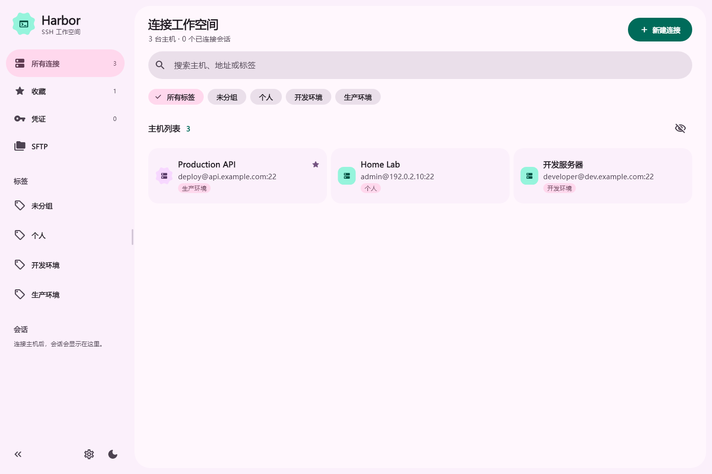
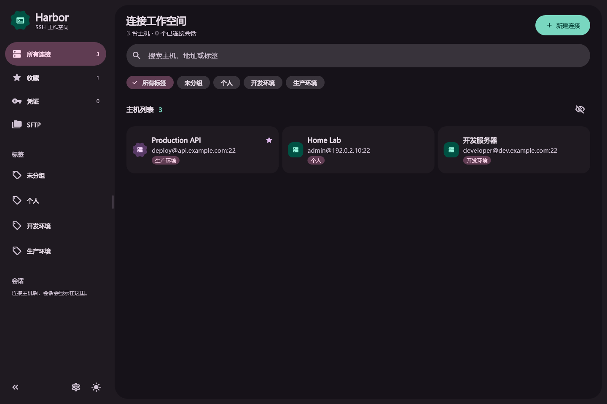
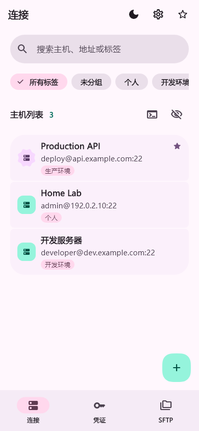
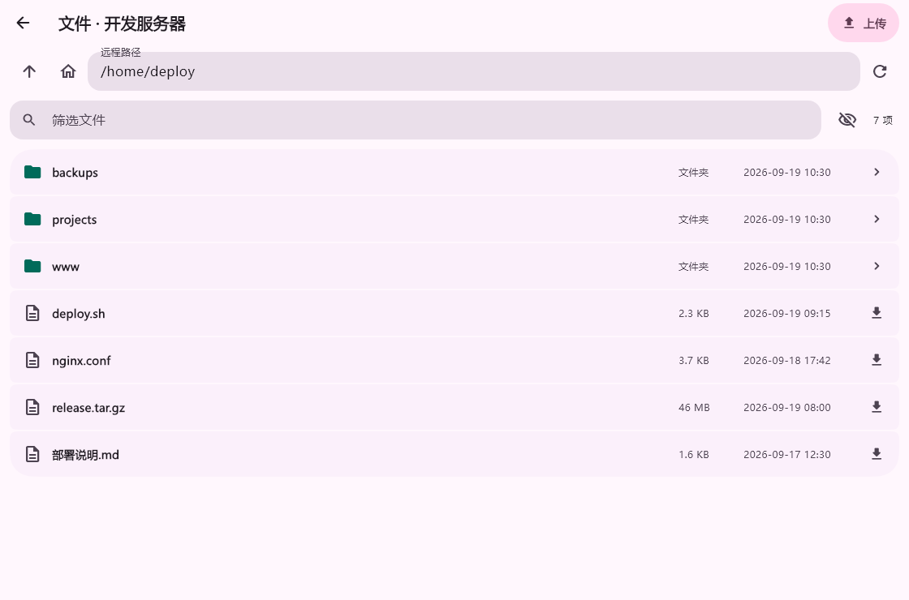
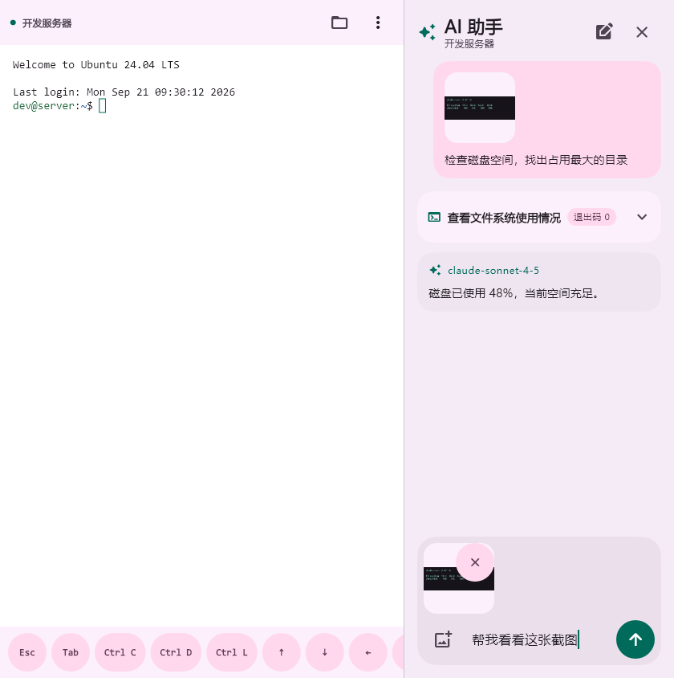

# Harbor SSH

面向 Windows、macOS 和 Android 的 SSH 工作空间。用同一套界面管理主机、终端、文件，以及当前会话里的 AI 助手。

## 功能

- **主机**：新增、编辑、删除、收藏、标签、搜索和拖动排序。
- **登录**：密码、PEM/OpenSSH 私钥和加密私钥口令。密码、私钥和已信任的主机指纹保存在系统安全存储。
- **连接**：首次连接显示 SHA256 指纹；指纹变化时弹窗对照新旧指纹，核实后可确认更新并继续连接，取消则保留原指纹并阻止连接。
- **终端**：多会话、复制粘贴、字体与换行、远端资源状态。手机提供常用按键辅助栏。
- **端口转发**：本地转发、远程转发和 SOCKS5 代理；按主机保存本机规则，支持启停与状态显示，断开 SSH 自动停止。见 [使用说明](docs/port-forwarding.md)。
- **文件**：SFTP 浏览和 UTF-8 文本编辑，可与本地目录互传。桌面端可拖放文件和文件夹。
  传输显示实时速度；ChaCha 解密与 SSH 接收窗口优化的实测结果见 [SFTP 性能说明](docs/SFTP_PERFORMANCE.md)。
- **AI**：在当前 SSH 会话中执行任务，支持图片和本机加密历史。Windows 可将面板弹出为独立窗口。
- **同步**：用 WebDAV 或 GitHub Gist 加密同步连接和凭证。不同步终端内容、AI 历史和主机指纹。

## 截图

| 桌面 | 深色 |
| --- | --- |
|  |  |

| 手机 | 文件 |
| --- | --- |
|  |  |



## 编译

需要 [Flutter 3.47.4](https://docs.flutter.dev/install)。

```sh
flutter pub get
flutter run -d windows
flutter run -d macos
flutter run -d <android-device-id>
```

发布构建：

```sh
# Windows，需要 Visual Studio 的「使用 C++ 的桌面开发」
flutter build windows --release

# macOS，需要 Xcode，且必须在 Mac 上执行
flutter build macos --release

# Android，需要 Android SDK 与 JDK
flutter build apk --release --split-per-abi
```

产物：

- Windows：`build/windows/x64/runner/Release/`。分发时保留整个目录，不要只拷贝 exe。
- macOS：`build/macos/Build/Products/Release/Harbor SSH.app`。
- Android：`build/app/outputs/flutter-apk/` 下按架构生成的 `app-*-release.apk`，安装与设备匹配的一个即可。

Android 正式签名使用 `android/key.properties.example` 对应的密钥。不要把 keystore 或密码提交到仓库。

## 凭证存储与恢复保护

Windows 保留兼容旧版的逐项安全存储，并在启动时安全迁回 1.0.10 的合并存储；仅在全部项目写入成功后移除合并副本。Windows 主窗口只允许一个实例，避免不同版本同时修改共享凭证。

云同步发现私钥缺失时，只从公钥身份一致的完整记录或同步基线恢复；无法恢复时停止同步，不把空私钥覆盖到其他设备。已有密码意外变空时需要明确选择保留的版本。删除整个凭证仍按正常同步规则处理。

## macOS 自签名

工程没有绑定付费的 Apple 开发者证书。要在其他 Mac 上打开，构建完成后用本机的「代码签名」证书自签。自签名不能替代 Apple 公证，对方第一次仍需手动确认。

1. 打开「钥匙串访问」→「证书助理」→「创建证书」。
2. 名称填 `Harbor SSH`，身份类型选「自签名根证书」，证书类型选「代码签名」，存入「登录」钥匙串。
3. 在仓库根目录执行。必须带上 Release 权限，否则沙盒里没有出站网络，也不能访问用户选择的文件夹。

```sh
APP="build/macos/Build/Products/Release/Harbor SSH.app"
IDENTITY="Harbor SSH"

find "$APP/Contents/Frameworks" -depth \( -name '*.framework' -o -name '*.dylib' \) -print0 |
  xargs -0 codesign --force --sign "$IDENTITY" --options runtime --timestamp=none

codesign --force --sign "$IDENTITY" --options runtime --timestamp=none \
  --entitlements macos/Runner/Release.entitlements \
  "$APP"

codesign --verify --deep --strict --verbose=2 "$APP"
```

从浏览器、隔空投送或其他 Mac 拷来的 App 先去掉隔离标记，再在 Finder 里右键「打开」一次：

```sh
xattr -dr com.apple.quarantine "/path/to/Harbor SSH.app"
```
